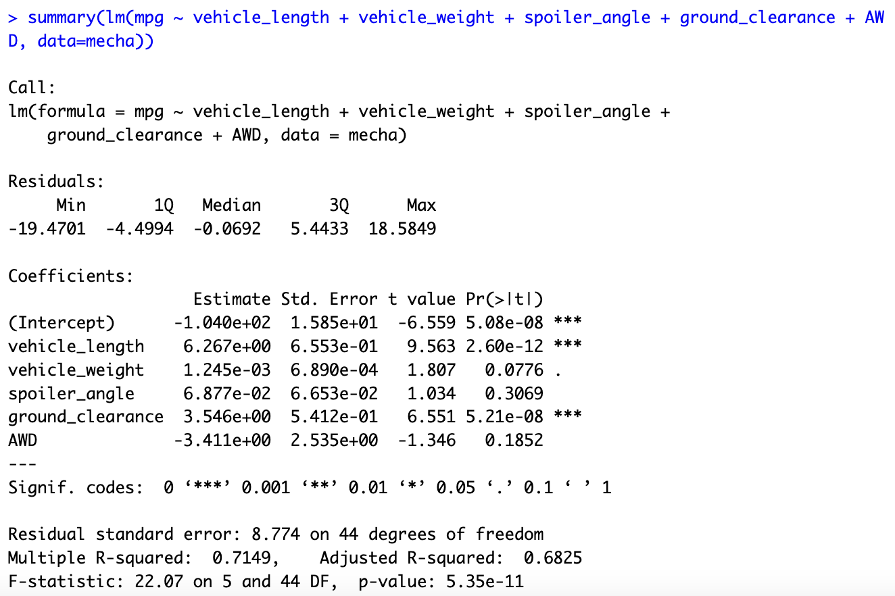
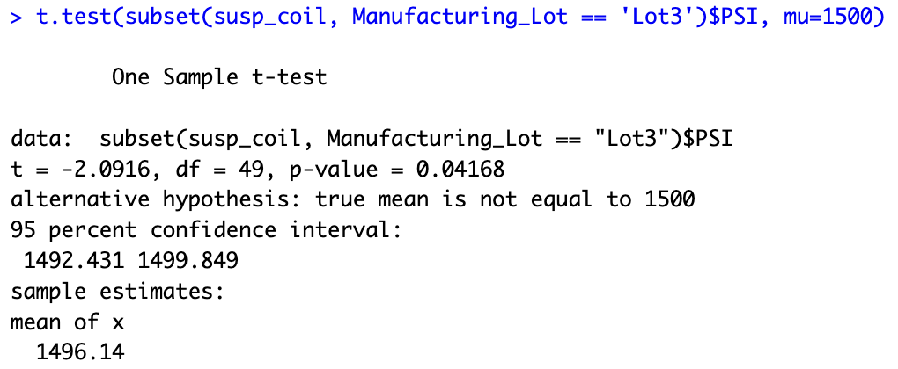

# MechaCar Statistical Analysis

# Summary & purpose
AutosRUs’ newest prototype, the MechaCar, is suffering from production troubles that are blocking the manufacturing team’s progress. AutosRUs’ upper management has called on Jeremy and the data analytics team to review the production data for insights that may help the manufacturing team.

In this challenge, it helps Jeremy and the data analytics team do the following:

- Perform multiple linear regression analysis to identify which variables in the dataset predict the mpg of MechaCar prototypes.
- Collect summary statistics on the pounds per square inch (PSI) of the suspension coils from the manufacturing lots.
- Run t-tests to determine if the manufacturing lots are statistically different from the mean population.
- Design a statistical study to compare vehicle performance of the MechaCar vehicles against vehicles from other manufacturers. For each statistical analysis, you’ll write a summary interpretation of the findings.

## Delivery 1
1. Which variables/coefficients provided a non-random amount of variance to the mpg values in the dataset?

  - Per the summary analysis, the p-value of Vehicle Length and Ground Clearance shows prespectively 2.60e-12 and 5.21e-08 which indicates statistical significance on mpg. In the meantime, the spoiler angle shows not significaly statistical related to the mpg. 

  

2. Is the slope of the linear model considered to be zero? Why or why not?

  - As the p-value (5.08e-08) below a significance level of 0.05%, we can reject the null hypothesis, which means the slope of this model can't be zero.

3. Does this linear model predict mpg of MechaCar prototypes effectively? Why or why not?

  - This model could be effectively predict the mpg of MechaCar. Per the anlaysis below, we can see the R-squared value for this model is 0.715 which means more than 70% of the observed variations can be explained by this models inputs, proving to be a good model to predict MPG effectively.

  

## Delivery 2
The design specifications for the MechaCar suspension coils dictate that the variance of the suspension coils must not exceed 100 pounds per square inch. Does the current manufacturing data meet this design specification for all manufacturing lots in total and each lot individually? Why or why not?

- Per the total variance analysis, the total variance for all lots is 62.3 PSI, which meets design specifications. Specifically, the analysis for each lot gives more details for different senarios:
  i. Lot 1 having a variance of 0.98 PSI and Lot 2 having a variance of 7.5 PSI respectively. Both of them don't meet the design specification requirements. 
  ii. However, the variance of Lot 3 shows 170.3 PSI, which is outside of the design specification requirements.

  - total variance
  

  - lot variance
  

## Delivery 3
In your README, create a subheading ## T-Tests on Suspension Coils, then briefly summarize your interpretation and findings for the t-test results. Include screenshots of the t-test to support your summary.

- All Lots t Test: P-Value for all lots is around 0.06 which is above our significance level of 0.05. Thus, it fails to reject null hypothesis.
  

- Lot1 t test: P-Value for all lots is around 1.00 which is above our significance level of 0.05. Thus, it fails to reject null hypothesis.
  

- Lot2 t test: P-Value for all lots is around 0.61 which is above our significance level of 0.05. Thus, it fails to reject null hypothesis.
  
   
- Lot3 t test: P-Value for all lots is around 0.42 which is above our significance level of 0.05. Thus, it fails to reject null hypothesis.
  
  
  
# Design a Study Comparing the MechaCar to the Competition
  
1. A metric to be tested is mentioned: Metrics- vehicle emissions

2. A null hypothesis or an alternative hypothesis is described:
- Null Hypothesis: MechaCar produces equal or more emissions than its competition
- Alternative Hypothesis: MechaCar produces less emissions than its competition

3. A statistical test is described to test the hypothesis: 
- The case study could run t tests between MechaCar and its individul competitors to show direct comparisons 
- The case study could run ANOVA between MechaCar and a group of main competitors or industry to show overall comparisons

5. The data for the statistical test is described : Emissions from both MechaCar and its competitors
 
