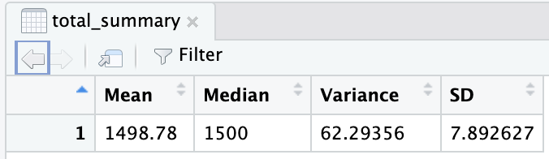
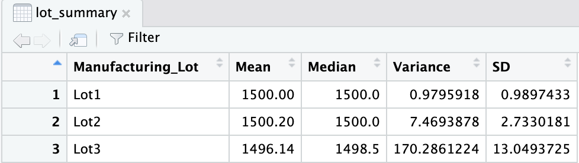
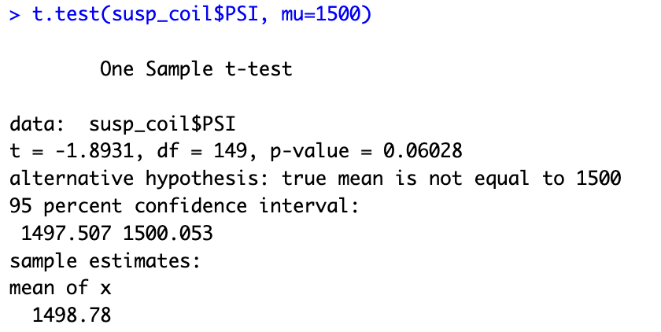
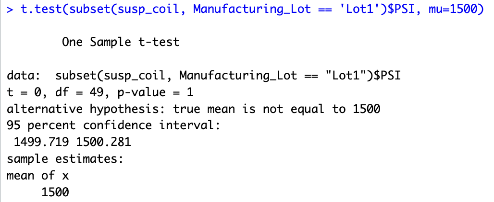

# MechaCar Statistical Analysis

AutosRUs’ newest prototype, the MechaCar, is suffering from production troubles that are blocking the manufacturing team’s progress. AutosRUs’ upper management has called on Jeremy and the data analytics team to review the production data for insights that may help the manufacturing team.

In this challenge, you’ll help Jeremy and the data analytics team do the following:

- Perform multiple linear regression analysis to identify which variables in the dataset predict the mpg of MechaCar prototypes.
- Collect summary statistics on the pounds per square inch (PSI) of the suspension coils from the manufacturing lots.
- Run t-tests to determine if the manufacturing lots are statistically different from the mean population.
- Design a statistical study to compare vehicle performance of the MechaCar vehicles against vehicles from other manufacturers. For each statistical analysis, you’ll write a summary interpretation of the findings.

## Delivery 1
1. Which variables/coefficients provided a non-random amount of variance to the mpg values in the dataset?

2. Is the slope of the linear model considered to be zero? Why or why not?

3. Does this linear model predict mpg of MechaCar prototypes effectively? Why or why not?
  
  
  
  

## Delivery 2
The design specifications for the MechaCar suspension coils dictate that the variance of the suspension coils must not exceed 100 pounds per square inch. Does the current manufacturing data meet this design specification for all manufacturing lots in total and each lot individually? Why or why not?

  

  

## Delivery 3
In your README, create a subheading ## T-Tests on Suspension Coils, then briefly summarize your interpretation and findings for the t-test results. Include screenshots of the t-test to support your summary.
  

  

  
   
   
  
